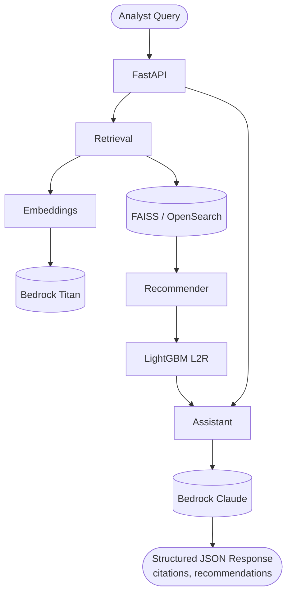

# OT Threat Research Assistant

[](https://caverac.github.io/threat-research-assistant/)

RAG-powered research assistant for ICS/OT threat intelligence, built on AWS Bedrock with a LightGBM learning-to-rank recommender.

## Motivation

ICS/OT security analysts spend significant time searching through advisories, threat reports, and incident records to answer questions like *"What vulnerabilities affect Modbus-connected PLCs?"* or *"Which APT groups have targeted energy sector SCADA systems?"*. This project automates that workflow by combining semantic search with ML-based reranking and LLM-generated answers — all backed by citations to original sources.

## Key Features

- **Retrieval-Augmented Generation**: Embeds analyst queries via Bedrock Titan, retrieves relevant chunks from a FAISS vector store, and generates structured answers with Bedrock Claude
- **LightGBM Learning-to-Rank**: Goes beyond embedding similarity — a trained LightGBM ranker rescores candidates using temporal decay, protocol/asset overlap, popularity, and recency features
- **Structured Output**: Every response includes the answer, source citations with relevance scores, and related document recommendations
- **ICS/OT Domain Model**: Typed Pydantic schemas for advisories, threat reports, and incidents with first-class support for ICS protocols (Modbus, DNP3, OPC-UA, EtherNet/IP, etc.) and asset types (PLC, RTU, HMI, SCADA, DCS, etc.)
- **Synthetic Data Generation**: Ships with a generator that creates realistic ICS-CERT-style advisories, APT campaign reports, and incident records for demo and training purposes
- **Live Ingestion**: Add new threat documents via S3 upload (Lambda-triggered) or the `/ingest` API, and hot-reload the index without restarting the service

## Architecture



## Packages

| Package | Description |
|---------|-------------|
| `core` | Shared Pydantic models, enums, configuration |
| `ingestion` | Data loading, parsing, chunking, synthetic data generation |
| `embeddings` | Bedrock Titan embeddings, FAISS vector store |
| `retrieval` | Hybrid retrieval pipeline with vector + keyword search |
| `recommender` | LightGBM learning-to-rank model for document reranking |
| `assistant` | Bedrock Claude research assistant with tool-calling |
| `api` | FastAPI service (`/query`, `/ingest`, `/reload-index`, `/health`) |
| `infra` | AWS CDK infrastructure (S3, Lambda, ECS Fargate, EventBridge, Bedrock IAM) |
| `docs` | MkDocs-material documentation site |

## Quick Start

```bash
# Clone the repository
git clone https://github.com/caverac/threat-research-assistant.git
cd threat-research-assistant

# Install all packages and pre-commit hooks
make install

# Generate synthetic threat data
make generate-data

# Build the FAISS index (calls Bedrock Titan for embeddings)
make build-index

# Train the recommender model
make train-recommender

# Run the API server
make serve
```

Then query the assistant:

```bash
curl -X POST "http://localhost:8000/query" \
  -H "Content-Type: application/json" \
  -d '{"question": "What vulnerabilities affect Modbus PLCs?", "max_results": 5}'
```

## API Endpoints

| Endpoint | Method | Description |
|----------|--------|-------------|
| `/health` | GET | Component status and document count |
| `/query` | POST | Ask the research assistant a question |
| `/ingest` | POST | Ingest a new threat document (advisory, threat report, or incident) |
| `/reload-index` | POST | Re-download FAISS index from S3 and hot-swap in memory |
| `/recommendations/{user_id}` | GET | Personalized recommendations (stub) |

## Development

```bash
# Run tests
make test

# Lint (flake8 + pylint + pydocstyle)
make lint

# Format (black + isort)
make format

# Type check (mypy)
make type-check

# Serve documentation locally
make docs-serve
```

## Requirements

- Python 3.12
- [uv](https://docs.astral.sh/uv/) package manager
- AWS account with [Bedrock model access](https://docs.aws.amazon.com/bedrock/latest/userguide/model-access.html) enabled for Titan Embeddings and Claude
- AWS credentials configured locally (`aws configure`)
- Node.js + Yarn (for CDK infrastructure only — not needed for local development)

## License

MIT
