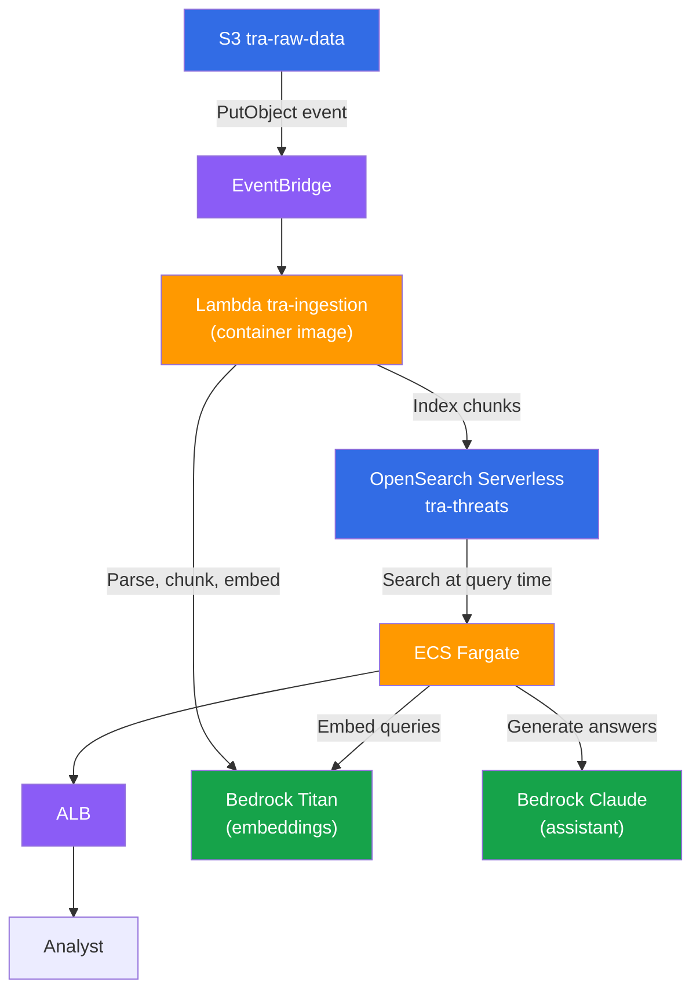

# AWS Infrastructure (OpenSearch)

!!! info "Not currently deployed"
    This page describes an alternative architecture. The current deployment uses [FAISS on S3](aws.md) instead. The only reason we did not go with OpenSearch Serverless is **cost** — FAISS + S3 is effectively free, while OpenSearch Serverless has a minimum charge of ~$700/month for a vector search collection (2 OCUs at $0.24/OCU-hour).

## Why OpenSearch Serverless

The [FAISS-based architecture](aws.md) works but has operational friction:

| Concern | FAISS on S3 | OpenSearch Serverless |
|---------|-------------|----------------------|
| **Index updates** | Lambda writes to S3, API must call `/reload-index` to pick up changes | Lambda writes directly to the collection, API sees changes immediately |
| **Concurrent writes** | FAISS is single-writer — concurrent Lambda invocations overwrite each other's index | OpenSearch handles concurrent writes natively |
| **Scaling** | Single Fargate task holds the entire index in memory | OpenSearch scales storage and compute independently |
| **Metadata filtering** | Post-hoc in Python after vector search | Native filtered queries in a single request |
| **Startup time** | Downloads index from S3 on every task start | No index download — queries go directly to OpenSearch |

In short, OpenSearch eliminates the `/reload-index` endpoint, the S3 index sync, and the concurrency limitation — at the cost of a higher AWS bill.

## Architecture

The key difference: the Lambda writes embeddings **directly to OpenSearch** instead of downloading/uploading a FAISS index from S3. The API queries OpenSearch at request time — no local index, no reload.

## CDK Stack

The `SearchStack` (`packages/infra/src/infra/stacks/search.py`) is already defined but not wired into the compute stack. It creates:

- **Encryption policy** — AWS-owned key encryption for the `tra-threats` collection
- **Network policy** — Public access to the collection endpoint
- **Collection** — `tra-threats` with type `VECTORSEARCH`

To fully integrate OpenSearch, the following changes would be needed:

1. **Lambda**: Write chunks + embeddings to the OpenSearch collection instead of downloading/uploading a FAISS index from S3
2. **API**: Replace `FAISSVectorStore` with an `OpenSearchVectorStore` that implements the existing `VectorStore` protocol
3. **Compute stack**: Pass the collection endpoint to both Lambda and Fargate via environment variables
4. **IAM**: Grant `aoss:APIAccessAll` to the Lambda and Fargate task roles

The `VectorStore` protocol (`add`, `search`, `delete`, `count`) was designed with this swap in mind — the retrieval pipeline, recommender, and assistant packages would not change.

## Cost Comparison

| Resource | FAISS on S3 | OpenSearch Serverless |
|----------|-------------|----------------------|
| Vector store | S3 storage (~$0.02/GB/month) | 2 OCUs minimum (~$350/OCU/month) |
| Lambda | Same | Same |
| Fargate | Same | Same |
| Bedrock | Same | Same |
| **Monthly minimum** | **~$30** (Fargate + Bedrock) | **~$730** (Fargate + Bedrock + OpenSearch) |

The ~$700/month difference is entirely the OpenSearch Serverless minimum. For a demo or low-traffic system, this is hard to justify. For a production system with multiple analysts, concurrent ingestion, and strict freshness requirements, the operational simplicity pays for itself.
