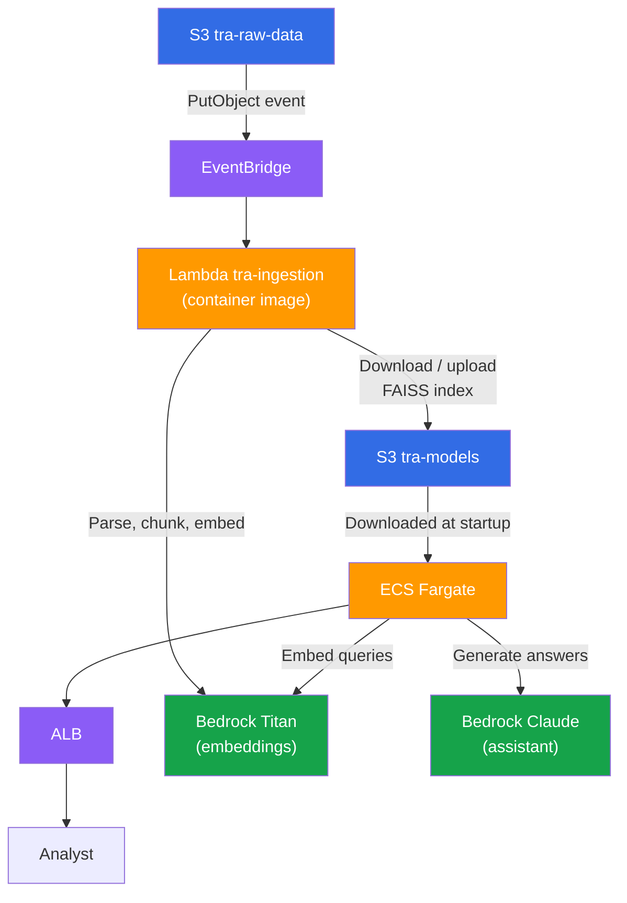

# AWS Infrastructure (FAISS)

!!! info "Looking for a managed vector store?"
    This architecture uses FAISS on S3 to keep costs near zero. For a production setup that eliminates the index reload workflow and supports concurrent writes, see [AWS Infrastructure (OpenSearch)](aws-opensearch.md).

## Production Architecture



## CDK Stacks

The `infra` package defines three CDK stacks:

| Stack | Resources |
|-------|-----------|
| `StorageStack` | S3 buckets (raw data, processed, models) |
| `BedrockStack` | IAM roles for Bedrock model access + S3 permissions |
| `ComputeStack` | Lambda (ingestion, container image), ECS/Fargate (API) with ALB |

## Local Development

For local development, the only AWS service the application calls is **Bedrock** (Titan for embeddings, Claude for the assistant). Everything else runs locally:

| Concern | Local | Production |
|---------|-------|------------|
| Vector store | FAISS on disk (`data/faiss_index/`) | FAISS on S3 (downloaded at startup) |
| Document storage | JSON files in `data/` | S3 buckets |
| Embeddings | Bedrock Titan | Bedrock Titan |
| LLM | Bedrock Claude | Bedrock Claude |
| Recommender | Local joblib file | S3 → downloaded at startup |

To run the system locally you need:

1. **AWS credentials** configured (`aws configure` or environment variables) with Bedrock access enabled for Titan Embeddings and Claude
2. That's it — no Docker, no LocalStack, no CDK deployment

## Deployment Walkthrough

### Prerequisites

- AWS CLI configured with appropriate credentials
- Node.js + Yarn (for CDK)
- Docker (for container image builds)

### Step 1: Build local artifacts

```bash
make generate-data      # Generate synthetic threat data
make build-index        # Build FAISS index (requires Bedrock)
make train-recommender  # Train LightGBM recommender model
```

### Step 2: Bootstrap CDK (first time only)

```bash
make cdk-bootstrap
```

### Step 3: Deploy all stacks

```bash
make cdk-deploy
```

This deploys:

- **TRAStorage** — S3 buckets
- **TRABedrock** — IAM roles with Bedrock + S3 permissions
- **TRACompute** — Lambda (container image), ECS Fargate service with ALB

### Step 4: Upload artifacts to S3

```bash
make upload-artifacts
```

Uploads the FAISS index and recommender model to the `tra-models` bucket.

### Step 5: Test the deployment

Upload a test document to trigger the Lambda:

```bash
ACCOUNT=$(aws sts get-caller-identity --query Account --output text)
REGION=$(aws configure get region)
aws s3 cp data/advisories/ICSA-2022-001.json \
  "s3://tra-raw-data-${ACCOUNT}-${REGION}/advisories/ICSA-2022-001.json"
```

Then hit the ALB health endpoint (the DNS name is stored in SSM):

```bash
curl "http://$(aws ssm get-parameter --name /tra/alb-dns --query Parameter.Value --output text)/health"
```

## Operations

Once the stacks are deployed and artifacts uploaded, the ALB DNS is available via SSM:

```bash
ALB=$(aws ssm get-parameter --name /tra/alb-dns --query Parameter.Value --output text)
```

All examples below assume this variable is set.

### Querying the assistant

!!! warning "Ingest data first"
    The assistant can only answer questions about documents that have been indexed. Before querying, either upload artifacts built locally (`make upload-artifacts`) and reload the index, or ingest documents via S3 or the `/ingest` API. See [Ingesting new documents](#ingesting-new-documents) below.

Send a natural-language question to the research assistant. The API embeds the query, retrieves relevant chunks from the FAISS index, reranks them with LightGBM, and generates a structured answer via Bedrock Claude.

```bash
curl -X POST "http://${ALB}/query" \
  -H "Content-Type: application/json" \
  -d '{"question": "What vulnerabilities affect Modbus PLCs?", "max_results": 5}'
```

The response includes `answer`, `citations` (source documents with relevance scores), `recommendations`, and `metadata` (timing, model ID, chunk counts).

### Ingesting new documents

There are two ways to add threat intelligence to the system.

**Option A — S3 upload (automatic)**

Drop a JSON file into the raw-data bucket. EventBridge triggers the Lambda, which parses, chunks, embeds (via Bedrock Titan), and updates the FAISS index on S3.

```bash
ACCOUNT=$(aws sts get-caller-identity --query Account --output text)
REGION=$(aws configure get region)

# Upload an advisory (prefix determines document type)
aws s3 cp advisory.json "s3://tra-raw-data-${ACCOUNT}-${REGION}/advisories/"

# Upload a threat report
aws s3 cp report.json "s3://tra-raw-data-${ACCOUNT}-${REGION}/threat_reports/"

# Upload an incident
aws s3 cp incident.json "s3://tra-raw-data-${ACCOUNT}-${REGION}/incidents/"
```

The S3 key prefix (`advisories/`, `threat_reports/`, `incidents/`) tells the Lambda which parser to use.

**Option B — Direct API call**

Ingest a document through the Fargate API. This runs the full parse → chunk → embed → index pipeline synchronously.

=== "Advisory"

    ```bash
    curl -X POST "http://${ALB}/ingest" \
      -H "Content-Type: application/json" \
      -d '{
        "source_type": "advisory",
        "document": {
          "id": "ICSA-2025-001",
          "title": "Siemens SIMATIC S7 Modbus Buffer Overflow",
          "published": "2025-01-15T00:00:00Z",
          "severity": "critical",
          "affected_products": [
            {"vendor": "Siemens", "product": "SIMATIC S7-1200", "version": "4.5.2"}
          ],
          "protocols": ["modbus"],
          "cve_ids": ["CVE-2025-12345"],
          "description": "A buffer overflow in the Modbus TCP handler allows remote code execution on SIMATIC S7-1200 PLCs.",
          "mitigations": ["Update to firmware 4.5.3", "Restrict Modbus access to trusted hosts"]
        }
      }'
    ```

=== "Threat Report"

    ```bash
    curl -X POST "http://${ALB}/ingest" \
      -H "Content-Type: application/json" \
      -d '{
        "source_type": "threat_report",
        "document": {
          "id": "TR-2025-010",
          "title": "VOLTZITE Campaign Targeting Energy Sector PLCs",
          "published": "2025-02-01T00:00:00Z",
          "threat_category": "apt",
          "actor": "VOLTZITE",
          "targets": ["plc", "scada"],
          "protocols": ["modbus", "dnp3"],
          "ttps": ["T0855", "T0836"],
          "summary": "VOLTZITE targets energy sector PLCs via Modbus exploitation.",
          "content": "Full report content goes here...",
          "iocs": ["192.168.1.100", "evil.example.com"]
        }
      }'
    ```

=== "Incident"

    ```bash
    curl -X POST "http://${ALB}/ingest" \
      -H "Content-Type: application/json" \
      -d '{
        "source_type": "incident",
        "document": {
          "id": "INC-2025-003",
          "reported": "2025-01-20T00:00:00Z",
          "sector": "energy",
          "asset_types": ["plc", "hmi"],
          "protocols": ["modbus"],
          "description": "Unauthorized Modbus write commands detected on PLC network.",
          "impact": "Temporary shutdown of turbine control system.",
          "related_advisory_ids": ["ICSA-2025-001"]
        }
      }'
    ```

??? info "Valid enum values"

    | Field | Values |
    |-------|--------|
    | `severity` | `critical`, `high`, `medium`, `low` |
    | `protocols` | `modbus`, `dnp3`, `opc-ua`, `ethernet-ip`, `profinet`, `bacnet`, `iec-61850`, `iec-104` |
    | `asset_types` / `targets` | `plc`, `rtu`, `hmi`, `scada`, `dcs`, `historian`, `engineering-workstation`, `safety-system` |
    | `threat_category` | `ransomware`, `apt`, `supply-chain`, `insider`, `vulnerability` |

!!! note
    Option A updates the FAISS index on S3, so subsequent Lambda invocations and new Fargate tasks see the changes. Option B updates the in-memory index of the running Fargate task only — the changes are lost when the task restarts. Use S3 ingestion for durable updates.

After ingesting via S3, tell the running Fargate service to pick up the updated index:

```bash
curl -X POST "http://${ALB}/reload-index"
```

This re-downloads the FAISS index from S3 and hot-swaps the in-memory store — no restart required.

### Health check

```bash
curl "http://${ALB}/health"
```

Returns component status: `vector_store` (ok + document count) and `reranker` (ok or not_loaded).

### Reloading the index

After the Lambda processes new documents and updates the index on S3, tell the running API to pick up the changes without a restart:

```bash
curl -X POST "http://${ALB}/reload-index"
```

Returns `previous_count` and `current_count` so you can verify the new documents are loaded.

### Updating the recommender model

Training runs **locally**, not in the cloud. The workflow is:

```bash
# 1. Train locally
make train-recommender

# 2. Upload the new model to S3
make upload-artifacts

# 3. Restart the Fargate service so it downloads the new model
CLUSTER=$(aws ecs list-clusters --query "clusterArns[?contains(@, 'TRA')]" --output text)
SERVICE=$(aws ecs list-services --cluster "${CLUSTER}" --query "serviceArns[0]" --output text)
aws ecs update-service --cluster "${CLUSTER}" --service "${SERVICE}" --force-new-deployment
```

The new task downloads the updated model from S3 on startup. Queries served by the old task continue working until it drains.

### Rebuilding the FAISS index

If you need to rebuild the index from scratch (e.g. after changing the embedding model or chunk settings):

```bash
# 1. Rebuild locally
make build-index

# 2. Upload to S3
make upload-artifacts

# 3. Tell the running service to reload
curl -X POST "http://${ALB}/reload-index"
```

### Available API endpoints

| Endpoint | Method | Description |
|----------|--------|-------------|
| `/health` | GET | Component status and document count |
| `/query` | POST | Ask the research assistant a question |
| `/ingest` | POST | Ingest a document directly |
| `/reload-index` | POST | Re-download FAISS index from S3 and hot-swap in memory |
| `/recommendations/{user_id}` | GET | Personalized recommendations (stub — returns `[]`) |

## Docker

Build and run the API image locally:

```bash
make docker-build
make docker-run
# Then: curl http://localhost:8000/health
```

## LocalStack (Optional)

The LocalStack bootstrap script creates S3 buckets that mirror the production CDK stacks. This is useful for testing the `DataLoader.load_from_s3()` method, but the main pipeline does not require it.

```bash
# Start LocalStack
docker run -d --name localstack -p 4566:4566 localstack/localstack

# Bootstrap resources
./packages/infra/scripts/localstack.sh

# Point the application at LocalStack
export TRA_AWS_ENDPOINT_URL=http://localhost:4566
```

!!! note
    Setting `TRA_AWS_ENDPOINT_URL` redirects **all** AWS calls (including Bedrock) to LocalStack. Since LocalStack does not emulate Bedrock, you cannot run the full pipeline with this variable set. Use it only for testing S3 code paths.
