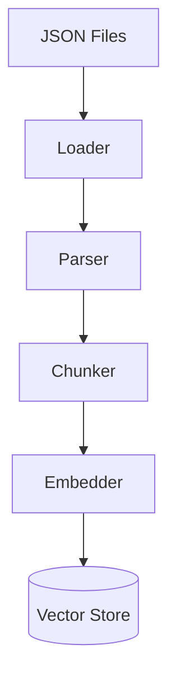
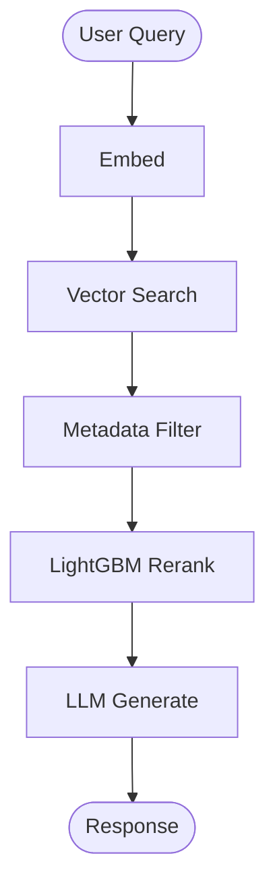

# Data Flow

## Ingestion Flow

1. Raw JSON documents loaded from filesystem or S3
2. Parsed into typed Pydantic models (Advisory, ThreatReport, Incident)
3. Chunked into overlapping text segments
4. Embedded via Bedrock Titan
5. Stored in FAISS (local) or OpenSearch (production)

## Query Flow

1. User submits a natural language question
2. Query embedded using Bedrock Titan
3. FAISS retrieves top-k similar chunks
4. Metadata filters narrow results
5. LightGBM reranker rescores candidates
6. Bedrock Claude generates a structured answer
7. Citations and recommendations attached to response
