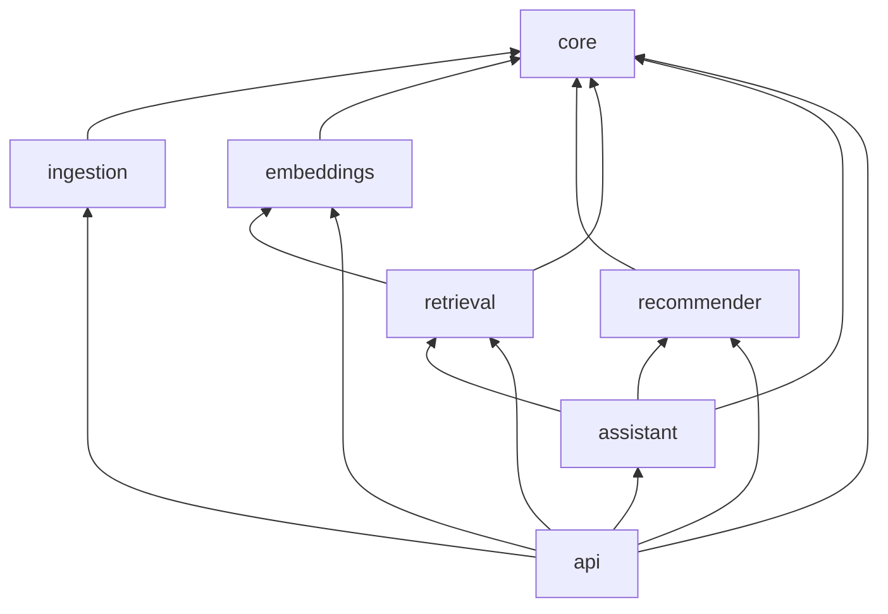

# Architecture Design

## Monorepo Structure

The project uses a UV workspace monorepo with Hatchling build system. Each package is independently testable with its own `pyproject.toml`.

## Design Principles

- **Dependency Injection**: All services are injected, enabling easy testing and swapping
- **Protocol-Based Interfaces**: Vector stores and rerankers use Python Protocols
- **Configuration via Environment**: All settings via `pydantic-settings` with `TRA_` prefix
- **Local-First Development**: FAISS for local vector search, LocalStack for AWS services

## Package Dependencies

## Package Overview

| Package | Purpose | Details |
|---------|---------|---------|
| [core](../packages/core.md) | Shared domain models, enums, and configuration | Pydantic schemas for advisories, reports, incidents; `Settings` via pydantic-settings |
| [ingestion](../packages/ingestion.md) | Data loading, parsing, chunking, and synthetic data generation | Filesystem/S3 loader, word-based overlapping chunker, ICS/OT synthetic data |
| [embeddings](../packages/embeddings.md) | Embedding generation and vector storage | Bedrock Titan client, `VectorStore` protocol, FAISS implementation |
| [retrieval](../packages/retrieval.md) | Hybrid retrieval pipeline with reranking | Vector + keyword search, LightGBM reranker integration |
| [recommender](../packages/recommender.md) | LightGBM learning-to-rank model | Feature engineering, training pipeline, inference |
| [assistant](../packages/assistant.md) | LLM research assistant via Bedrock Claude | Prompt templates, tool definitions, retrieval-augmented generation chain |
| [api](../packages/api.md) | FastAPI service layer | Query, recommendation, and ingestion endpoints with dependency injection |
