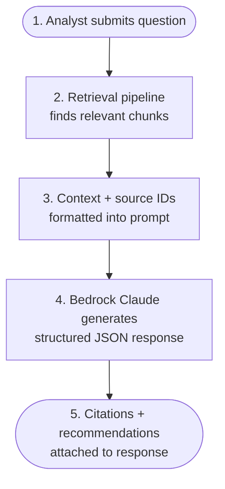

# Research Assistant

The research assistant uses AWS Bedrock Claude to answer OT/ICS security questions with citations.

## How It Works

## Prompt Templates

The assistant uses versioned prompt templates:

- **Research Query**: Answer questions with citations
- **Summarize**: Summarize threat reports
- **Compare**: Compare incidents or advisories

## Tool Calling

The assistant supports Bedrock tool-calling for:

- `search_threats`: Search the threat database
- `get_advisory`: Retrieve a specific advisory
- `get_recommendations`: Get ML-powered recommendations
