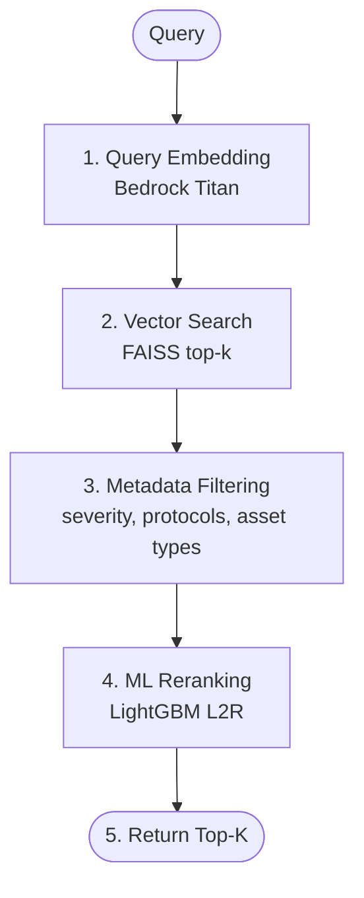

# Retrieval Pipeline

The retrieval pipeline combines vector similarity search with metadata filtering and ML reranking.

## Pipeline Stages



## Usage

```python
from core.enums import Protocol
from core.schemas import QueryFilters
from retrieval.pipeline import RetrievalPipeline

results, elapsed_ms = pipeline.run(
    query="Modbus PLC vulnerabilities",
    top_k=5,
    retrieval_k=20,
    filters=QueryFilters(protocols=[Protocol.MODBUS]),
)
```
