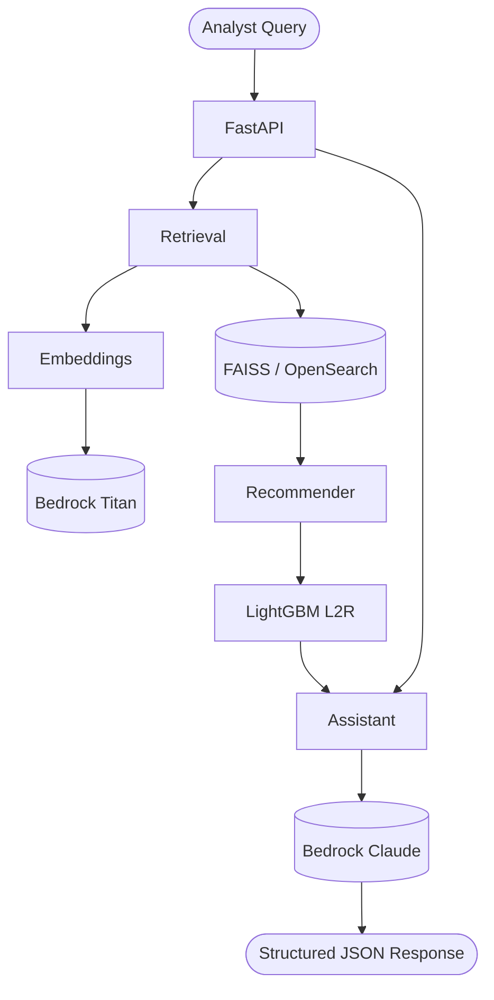

# OT Threat Research Assistant

RAG-powered research assistant for ICS/OT threat intelligence, built on AWS Bedrock with a LightGBM learning-to-rank recommender.

## Features

- **Intelligent Search**: Hybrid vector + keyword retrieval across threat advisories, reports, and incidents
- **ML-Powered Ranking**: LightGBM learning-to-rank model reranks results based on relevance features
- **Research Assistant**: Bedrock Claude generates structured answers with citations
- **Structured Output**: JSON responses with citations, recommendations, and metadata

## Architecture

## Quick Links

- [Installation](getting-started/installation.md)
- [Quick Start](getting-started/quickstart.md)
- [Architecture Design](architecture/design.md)
