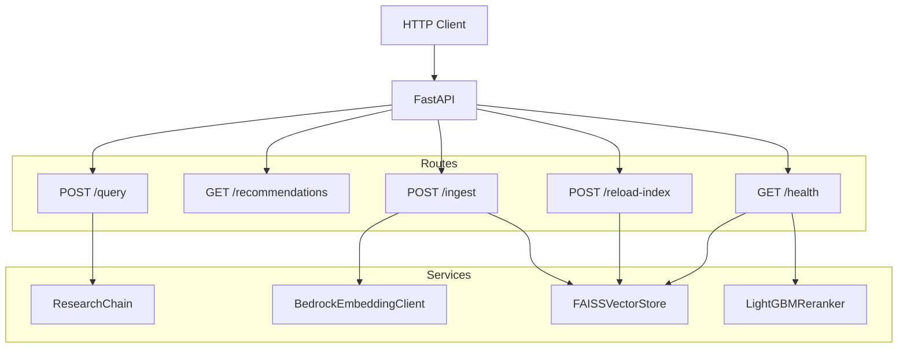

# API Package

The `api` package is the FastAPI service that exposes the entire system over HTTP. It wires together every other package through dependency injection at startup, provides four route groups, and uses Pydantic models from `core` as the request/response contract.

## What It Does

Two core modules and a `routes/` directory:

- **`app`** — Application factory (`create_app()`) with a lifespan handler that initializes and tears down services
- **`dependencies`** — Service initialization and FastAPI dependency functions that pull services from `app.state`
- **`routes/`** — Five route modules:
    - `query` — `POST /query` — ask the research assistant a question
    - `recommend` — `GET /recommendations/{user_id}` — get personalized recommendations
    - `ingest` — `POST /ingest` — add a new threat document to the index
    - `reload` — `POST /reload-index` — re-download FAISS index from S3 and hot-swap in memory
    - `health` — `GET /health` — component status check



## Why It's Designed This Way

### Application factory pattern

`create_app()` returns a fully configured `FastAPI` instance. This pattern is standard in FastAPI projects because:

- **Testing**: Tests call `create_app()` to get a fresh app with no shared state between test cases
- **Uvicorn integration**: `uvicorn api.app:create_app --factory` passes the factory to uvicorn, which calls it at worker startup
- **Configuration flexibility**: Different environments (local dev, CI, production) can configure settings via environment variables before the factory is called

### Lifespan for service initialization

All heavy initialization — loading the FAISS index from disk, loading the LightGBM model, creating Bedrock clients — happens in the `lifespan` async context manager, not at import time. This means:

- **Import is fast**: Importing `api.app` doesn't trigger boto3 calls or file I/O
- **Startup failures are visible**: If the FAISS index is missing or Bedrock credentials are wrong, the error surfaces at startup, not on the first request
- **Graceful degradation**: The reranker loads only if `recommender_model_path` exists. If it doesn't, the retrieval pipeline runs without reranking — the system still works, just with vector-only ranking

### Dependency injection via app.state

Services are stored on `app.state` and accessed through dependency functions (`get_research_chain`, `get_vector_store`, etc.) that take a `Request` object. This approach:

- **Avoids global state**: No module-level singletons. Each `create_app()` call produces an independent service graph
- **Makes dependencies explicit**: Route handlers declare what they need through their function signatures. `query_assistant` needs `get_research_chain`; `ingest_document` needs `get_embedding_client` and `get_vector_store`
- **Simplifies testing**: Tests can override `app.state` attributes with mocks without patching module-level imports

### Route structure

Each route module is a thin adapter — it extracts dependencies, delegates to the appropriate service, and returns the result. No business logic lives in routes:

| Endpoint | Method | Input | Output | Delegates to |
|----------|--------|-------|--------|-------------|
| `/query` | POST | `QueryRequest` | `QueryResponse` | `ResearchChain.run()` |
| `/recommendations/{user_id}` | GET | path param + query param | `list[Recommendation]` | Stub (returns `[]`) |
| `/ingest` | POST | `source_type` + `document` dict | status + chunk count | `DocumentParser` → `TextChunker` → `BedrockEmbeddingClient` → `FAISSVectorStore` |
| `/reload-index` | POST | — | previous + current count | `reload_index()` — re-downloads FAISS index from S3, rebuilds retriever and pipeline |
| `/health` | GET | — | component status dict | Direct `app.state` inspection |

The recommendations endpoint is intentionally stubbed. It returns an empty list because personalized recommendations require user interaction history, which doesn't exist in the demo system. The endpoint exists so the API contract is complete and the infrastructure is ready when interaction tracking is added.

### Ingest endpoint as a live pipeline

`POST /ingest` runs the full ingestion-to-embedding pipeline in a single request: parse the document, chunk it, embed each chunk via Bedrock Titan, and add to the FAISS index. This lets analysts add new threat data without rebuilding the entire index. The trade-off is latency — embedding happens synchronously — but for single-document ingestion this is acceptable.

### Health check with component status

`GET /health` reports the status of each critical component:

- **vector_store**: `ok` + document count — confirms the FAISS index is loaded and shows how many chunks are searchable
- **reranker**: `ok` or `not_loaded` — tells the operator whether the LightGBM model was found at startup

This gives operators a single endpoint to verify the system is ready to serve queries.

### Index reload without restart

When the Lambda ingestion function updates the FAISS index on S3, the running Fargate task still holds the old index in memory. `POST /reload-index` solves this by:

1. Deleting the local index files (so they aren't treated as "already present")
2. Re-downloading the latest index from S3
3. Loading it into a new `FAISSVectorStore`
4. Rebuilding the `HybridRetriever`, `RetrievalPipeline`, and `ResearchChain` with the new store

This is a hot-swap — queries in flight continue against the old store, and subsequent queries use the new one. No container restart or ECS deployment needed.

## Module Reference

### create_app

The application factory. Returns a `FastAPI` instance with all routes mounted and the lifespan handler attached.

```
uvicorn api.app:create_app --factory --host 0.0.0.0 --port 8000
```

### initialize_services

Called during lifespan startup. Creates and stores on `app.state`:

| Service | Type | Condition |
|---------|------|-----------|
| `settings` | `Settings` | Always |
| `embedding_client` | `BedrockEmbeddingClient` | Always |
| `vector_store` | `FAISSVectorStore` | Loads from disk if index exists |
| `retriever` | `HybridRetriever` | Always |
| `reranker` | `LightGBMReranker` | Only if model file exists |
| `retrieval_pipeline` | `RetrievalPipeline` | Always (reranker may be `None`) |
| `assistant_client` | `BedrockAssistantClient` | Always |
| `research_chain` | `ResearchChain` | Always |

### Dependency functions

| Function | Returns | Used by |
|----------|---------|---------|
| `get_settings(request)` | `Settings` | — |
| `get_research_chain(request)` | `ResearchChain` | `/query` |
| `get_vector_store(request)` | `FAISSVectorStore` | `/ingest`, `/health` |
| `get_embedding_client(request)` | `BedrockEmbeddingClient` | `/ingest` |
| `reload_index(app)` | `(int, int)` | `/reload-index` — returns `(previous_count, current_count)` |
