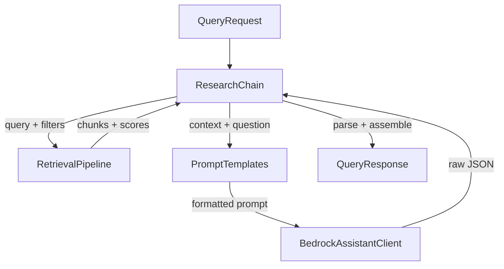

# Assistant Package

The `assistant` package is the LLM layer of the system. It takes retrieved context from the retrieval pipeline, builds a structured prompt, sends it to Bedrock Claude, and parses the response into a `QueryResponse` with citations and recommendations. It also defines tool schemas for Claude's tool-calling capability.

## What It Does

Four modules:

- **`client`** — `BedrockAssistantClient` wraps the Bedrock runtime API for Claude. Handles `invoke_model`, tool-calling, and simple text generation
- **`prompts`** — `PromptTemplates` holds versioned prompt templates for three tasks: research queries (with citations), report summarization, and incident/advisory comparison
- **`tools`** — `TOOL_DEFINITIONS` defines three tools that Claude can call: `search_threats`, `get_advisory`, and `get_recommendations`
- **`chain`** — `ResearchChain` orchestrates the full RAG flow: retrieve → build prompt → invoke LLM → parse JSON → assemble `QueryResponse`

## Why It's Designed This Way

### Client as a thin Bedrock wrapper

`BedrockAssistantClient` does three things: build the request body, call `invoke_model`, and parse the response. It does not manage conversation state, retry logic, or prompt construction — those belong to the chain and the caller. This keeps the client reusable across different prompt strategies and makes it easy to test by mocking a single boto3 call.

The client supports both simple generation (`generate()`) and tool-calling (`invoke_with_tools()`), both routed through the same `invoke()` method. The Anthropic Messages API format (`anthropic_version`, `messages`, `system`, `tools`) is used directly since Bedrock Claude expects it.

### Prompt templates as static methods

Prompts are plain string-building methods, not a template engine. This is intentional:

- **Plain f-strings**: The templates use f-strings, not a template engine. For structured prompts with known variables, f-strings are more readable and type-checkable than template syntax
- **Versioned**: The `VERSION` class attribute tracks the prompt version. When prompt changes affect output quality, the version bumps, making it easy to correlate model behavior with prompt changes in logs
- **JSON output instruction**: Each template instructs Claude to respond in JSON with specific keys. This produces parseable structured output without needing Bedrock's constrained decoding — the `_parse_response` method gracefully falls back to raw text if JSON parsing fails

Three prompt types cover the core analyst workflows:

| Template | Use case | Output keys |
|----------|----------|-------------|
| `research_query` | Answer a question with citations from retrieved context | `answer`, `cited_sources`, `confidence`, `related_topics` |
| `summarize` | Produce an executive summary of a threat report | `summary`, `key_findings`, `affected_systems`, `mitigations` |
| `compare` | Find patterns across multiple incidents or advisories | `patterns`, `differences`, `connections`, `assessment` |

### Tool definitions

The `TOOL_DEFINITIONS` list follows the Anthropic tool-calling schema and defines three tools:

| Tool | Purpose |
|------|---------|
| `search_threats` | Search the threat database with optional filters (source type, severity) |
| `get_advisory` | Retrieve a specific advisory by ID |
| `get_recommendations` | Get ML-powered recommendations for related intelligence |

The current `ResearchChain` uses `generate()` (single-turn prompt/response) rather than `invoke_with_tools()`. The tool definitions are wired into the client but not yet used by the chain — they're ready for a future agentic mode where Claude autonomously decides when to fetch additional context.

### ResearchChain as the orchestrator

`ResearchChain` is the single entry point for the API layer. It takes a `QueryRequest` and returns a `QueryResponse`, hiding the multi-step flow:

1. **Retrieve** — run the retrieval pipeline (embed → search → filter → rerank)
2. **Build context** — format retrieved chunks as `[SOURCE_ID] (relevance: 0.XXX)\n{content}`, separated by `---` dividers
3. **Generate** — send the formatted prompt with system instructions to Claude
4. **Parse** — extract `answer` and `cited_sources` from the JSON response, falling back to raw text
5. **Assemble** — build `Citation` and `Recommendation` objects from retrieval results, filtered to only sources the LLM actually cited
6. **Metadata** — capture `model_id`, `retrieval_time_ms`, `generation_time_ms`, chunk counts for observability

The citation filter (step 5) is important: only sources the LLM references in its answer appear in the citations list. This avoids presenting irrelevant citations that were retrieved but not used — analysts trust citations more when they're specific.

### Graceful JSON parsing

The `_parse_response` method tries `json.loads()` first. If Claude returns malformed JSON or plain text, the entire response becomes the `answer` field with an empty citations list. This means the system never crashes on an unexpected LLM output — it degrades to an uncited answer rather than a 500 error.

## Module Reference

### BedrockAssistantClient

| Method | Description |
|--------|------------|
| `invoke(messages, system=None, tools=None)` | Send messages to Bedrock Claude, return the full response dict |
| `generate(prompt, system=None)` | Simple text generation from a single prompt string |
| `invoke_with_tools(messages, system=None, tools=None)` | Invoke with tool-calling support |
| `model_id` | Property returning the configured Bedrock model ID |

Configuration via `Settings`:

| Setting | Default | Description |
|---------|---------|-------------|
| `TRA_BEDROCK_LLM_MODEL_ID` | `us.anthropic.claude-opus-4-5-20251101-v1:0` | Bedrock model ID for the assistant |
| `TRA_BEDROCK_MAX_TOKENS` | `4096` | Maximum tokens in the response |

### PromptTemplates

| Method | Description |
|--------|------------|
| `research_query(question, context, source_ids)` | Build a cited research answer prompt |
| `summarize(title, content)` | Build a threat report summarization prompt |
| `compare(items)` | Build a comparison prompt for multiple items |

### ResearchChain

| Method | Description |
|--------|------------|
| `run(request)` | Execute the full chain: retrieve → prompt → LLM → parse → `QueryResponse` |
