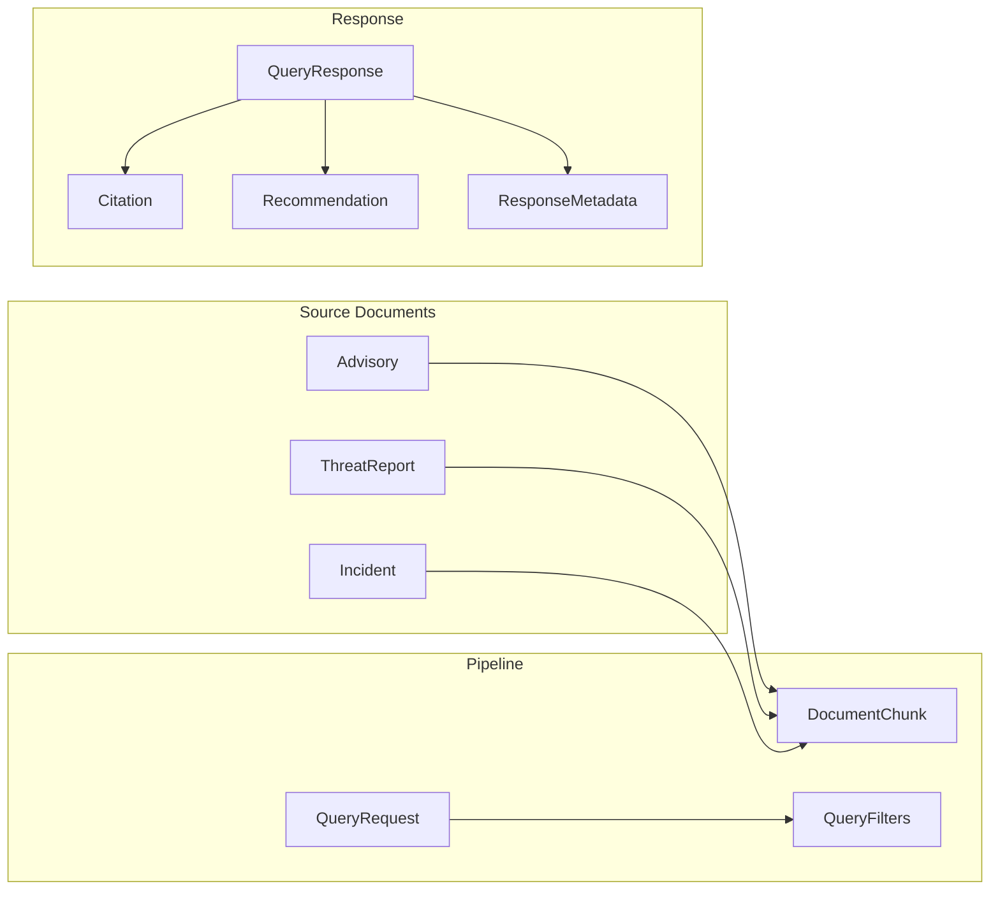

# Core Package

The `core` package is the shared foundation for all other packages. It defines the domain model, enumerations, and configuration — nothing else. Every other package in the monorepo depends on `core`.

## What It Does

Core provides three modules:

- **`schemas`** — Pydantic models for the ICS/OT threat intelligence domain (advisories, threat reports, incidents) and for the API request/response contract (queries, citations, recommendations)
- **`enums`** — String enumerations for ICS protocols, asset types, severity levels, and threat categories
- **`config`** — A single `Settings` class backed by `pydantic-settings`, loading all configuration from environment variables with the `TRA_` prefix

## Why It's Designed This Way

### Pydantic for the domain model

Every piece of data flowing through the system — from raw JSON ingestion to the final API response — passes through a Pydantic model. This gives us:

- **Validation at boundaries**: Malformed advisory data fails at parse time, not deep inside the retrieval pipeline
- **Serialization for free**: `model_dump_json()` for disk storage, `model_validate()` for loading, and FastAPI uses the models directly as request/response schemas
- **A single source of truth**: The `Advisory` model in `core` is the same one used by `ingestion` (parsing and chunking), `retrieval` (search), and `api` (serving) — no translation layers

### String enums for ICS vocabulary

Protocols like Modbus, DNP3, and OPC-UA are not arbitrary strings — they're a closed set that appears in metadata filters, feature engineering, and search queries. Using `str, Enum` means:

- They serialize as plain strings in JSON (not integers)
- Typos are caught at validation time
- IDE autocomplete works when building queries or filters

### Centralized configuration

All settings live in one class rather than scattered across packages. A single `.env` file or set of environment variables configures the entire system. The `TRA_` prefix avoids collisions with other tools.

## Domain Model

**Source documents** represent the three types of OT threat intelligence the system ingests:

| Model | Represents | Key fields |
|-------|-----------|------------|
| `Advisory` | ICS-CERT-style security advisories | severity, affected products, CVE IDs, protocols, mitigations |
| `ThreatReport` | Threat intelligence reports on campaigns | threat category, actor, MITRE ATT&CK TTPs, IOCs |
| `Incident` | OT security incident records | sector, asset types, impact, related advisory IDs |

**Pipeline models** are internal to the retrieval flow:

| Model | Purpose |
|-------|---------|
| `DocumentChunk` | A text segment of a source document with optional embedding vector |
| `QueryRequest` | An analyst's question with optional metadata filters |
| `QueryFilters` | Narrowing criteria: severity, protocols, asset types, date range |

**Response models** are the API output contract:

| Model | Purpose |
|-------|---------|
| `QueryResponse` | The full structured response: answer + citations + recommendations |
| `Citation` | Links an answer back to a source document with relevance score |
| `Recommendation` | A suggested related document from the recommender |
| `ResponseMetadata` | Timing, model ID, and chunk counts for observability |
