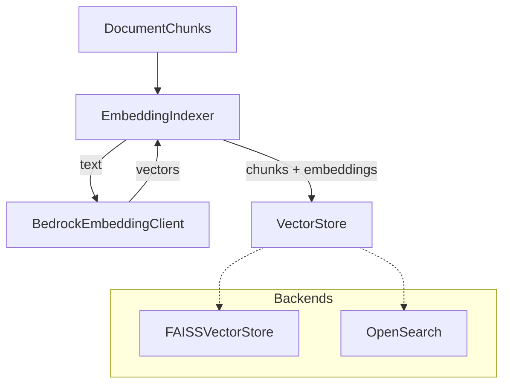

# Embeddings Package

The `embeddings` package converts text into vectors and stores them for similarity search. It wraps AWS Bedrock Titan for embedding generation, defines a `VectorStore` protocol for backend-agnostic storage, and provides a FAISS implementation for local development.

## What It Does

Three modules:

- **`client`** — Calls Bedrock Titan Embeddings to turn text into 1024-dimensional vectors
- **`store`** — A `VectorStore` protocol plus a `FAISSVectorStore` implementation that handles add, search, delete, save, and load
- **`index`** — An `EmbeddingIndexer` that orchestrates: take chunks, generate embeddings, upsert to the store

## Why It's Designed This Way

### Protocol-based store interface

`VectorStore` is a Python `Protocol` with four methods: `add`, `search`, `delete`, `count`. The retrieval pipeline depends on this protocol, not on FAISS directly. This means:

- **Local development** uses `FAISSVectorStore` — zero infrastructure, the index lives as a file on disk
- **Production** can swap in an OpenSearch implementation that satisfies the same protocol — no changes to retrieval, recommender, or assistant code
- **Testing** uses the FAISS store with small synthetic data — no mocks needed for the storage layer itself

### FAISS with inner product and L2 normalization

The FAISS index uses `IndexFlatIP` (inner product) rather than `IndexFlatL2` (Euclidean distance). Before adding vectors, they are L2-normalized with `faiss.normalize_L2()`. Inner product on L2-normalized vectors is equivalent to cosine similarity, which is the standard metric for semantic similarity with Titan embeddings. This approach avoids the need to convert distances to similarities after search.

### Metadata stored alongside the index

`FAISSVectorStore` keeps a parallel `metadata.json` next to `index.faiss`. Each entry is a serialized `DocumentChunk` (including the chunk's source ID, type, content, and metadata dict). On `save()`, both files are written atomically. On `load()`, the chunk list and ID-to-position mapping are reconstructed. This means:

- The vector store is fully self-contained — one directory is all you need to restore it
- Search results return complete `DocumentChunk` objects, not just IDs that require a separate lookup
- Metadata filtering (by severity, protocol, date) can happen in Python after the approximate nearest-neighbor search

### Delete rebuilds the index

FAISS `IndexFlatIP` does not support in-place deletion. When chunks are deleted, the store rebuilds the entire index from the remaining chunks. This is acceptable because:

- Deletions are infrequent (re-ingestion, not real-time)
- The index is small enough for a full rebuild (thousands, not millions of vectors)
- It avoids the complexity of tombstone-based soft deletion

### Batch embedding with sequential calls

Titan Embeddings does not support batch embedding in a single API call. `embed_texts()` iterates over texts individually, grouped into logical batches for progress tracking. This is straightforward to replace with concurrent calls or a batch API if Bedrock adds one.

## Module Reference

### BedrockEmbeddingClient

| Method | Description |
|--------|------------|
| `embed_text(text)` | Generate a single embedding vector (1024 floats) |
| `embed_texts(texts, batch_size=10)` | Generate embeddings for multiple texts |
| `embed_texts_as_numpy(texts, batch_size=10)` | Same as above, returned as a `np.ndarray` |

Configuration via `Settings`:

| Setting | Default | Description |
|---------|---------|-------------|
| `TRA_BEDROCK_EMBEDDING_MODEL_ID` | `amazon.titan-embed-text-v2:0` | Bedrock model ID for embeddings |
| `TRA_AWS_REGION` | `us-east-1` | AWS region for Bedrock calls |
| `TRA_AWS_ENDPOINT_URL` | `None` | Override for LocalStack |

### VectorStore (Protocol)

| Method | Description |
|--------|------------|
| `add(chunks)` | Add chunks with embeddings to the store |
| `search(query_embedding, top_k=10)` | Return `(DocumentChunk, score)` pairs ranked by similarity |
| `delete(chunk_ids)` | Remove chunks by ID |
| `count()` | Number of chunks in the store |

### FAISSVectorStore

Implements `VectorStore` plus persistence:

| Method | Description |
|--------|------------|
| `save(path)` | Write `index.faiss` and `metadata.json` to a directory |
| `load(path)` | Restore the index and chunk metadata from disk |

Default dimension: **1024** (matching Titan Embed Text v2).

### EmbeddingIndexer

| Method | Description |
|--------|------------|
| `index_chunks(chunks, batch_size=10)` | Embed chunks that lack embeddings, add all to the store. Returns count |
| `reindex_all(chunks, batch_size=10)` | Clear existing entries and re-embed everything. Returns count |
