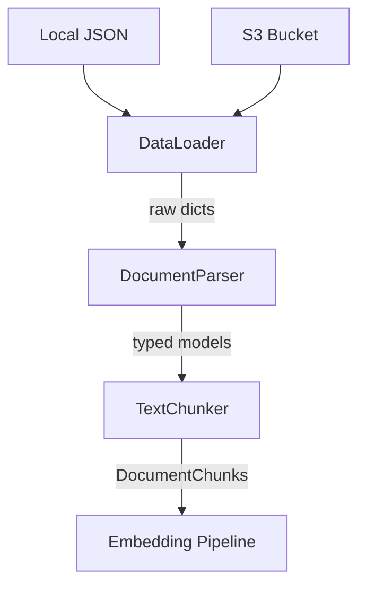

# Ingestion Package

The `ingestion` package turns raw threat intelligence data into chunked, embeddable documents. It handles loading JSON from the filesystem or S3, parsing it into `core` domain models, splitting it into overlapping text chunks, and generating synthetic data for development.

## What It Does

Four modules, each with a single responsibility:

- **`loader`** — Reads JSON files from a local directory or an S3 bucket, returning raw dictionaries
- **`parser`** — Validates those dictionaries against `core` Pydantic models (`Advisory`, `ThreatReport`, `Incident`)
- **`chunker`** — Splits validated documents into overlapping `DocumentChunk` objects sized for embedding
- **`synthetic`** — Generates realistic ICS/OT threat data (50 advisories, 30 reports, 20 incidents) seeded for reproducibility

## Why It's Designed This Way

### Loader/parser separation

The loader returns plain `dict` objects on purpose. It doesn't know or care what kind of document it's reading — it just finds `.json` files and deserializes them. Validation is the parser's job, using `model_validate()` from Pydantic. This means:

- The loader can be reused for any JSON data source without coupling to the domain model
- Validation errors surface with clear Pydantic messages pointing at the exact field, not buried inside file I/O logic
- Testing each concern independently is straightforward: loaders get filesystem/S3 mocks, parsers get sample dictionaries

### S3 support through settings

`DataLoader` accepts a `Settings` object. When `aws_endpoint_url` is set (e.g. to LocalStack), the S3 client uses that endpoint. In production the field is `None` and boto3 uses its default resolution. No conditional logic, no "local vs. cloud" flag — just dependency injection through configuration.

### Word-based chunking with overlap

The chunker splits on whitespace rather than characters or sentences. This is a deliberate trade-off:

- **Why words, not characters**: Character-based splitting can cut words in half, producing meaningless tokens that waste embedding dimensions
- **Why overlap**: A fact that spans two chunks (e.g. "affects Modbus / and DNP3 protocols") would be lost if chunks had hard boundaries. The configurable overlap (`TRA_CHUNK_OVERLAP`, default 50 words) duplicates context at boundaries so the embedding model sees complete thoughts
- **Why not sentence-based**: Sentence detection adds a dependency (spaCy, NLTK) and ICS advisories often use fragments, bullet lists, and tables that don't follow standard sentence structure

Chunk IDs are deterministic SHA-256 hashes of `{source_id}::{chunk_index}`, so re-ingesting the same document produces the same chunk IDs — enabling idempotent index updates.

### Metadata propagation

Each `DocumentChunk` carries metadata extracted from its source document: severity, protocols, CVE IDs, sector, published date. This metadata flows through to the vector store and enables filtered retrieval (e.g. "show me only critical Modbus advisories") without a separate metadata index.

### Synthetic data for development

The `synthetic` module generates realistic-looking ICS threat data using actual vendor names (Siemens, Schneider, Rockwell), Dragos-style threat actor names (VOLTZITE, XENOTIME), MITRE ATT&CK for ICS technique IDs, and real vulnerability types. The seed is fixed (`random.seed(42)`) so generated data is deterministic across runs.

## Module Reference

### DataLoader

| Method | Description |
|--------|------------|
| `load_json_directory(directory)` | Load all `.json` files from a local path |
| `load_advisories()` | Load from `{data_dir}/advisories/` |
| `load_threat_reports()` | Load from `{data_dir}/threat_reports/` |
| `load_incidents()` | Load from `{data_dir}/incidents/` |
| `load_from_s3(bucket, prefix)` | Paginate through an S3 prefix and load all `.json` objects |

### DocumentParser

| Method | Description |
|--------|------------|
| `parse_advisory(data)` | Validate a single dict into an `Advisory` |
| `parse_threat_report(data)` | Validate a single dict into a `ThreatReport` |
| `parse_incident(data)` | Validate a single dict into an `Incident` |
| `parse_advisories(data_list)` | Batch parse advisories |
| `parse_threat_reports(data_list)` | Batch parse threat reports |
| `parse_incidents(data_list)` | Batch parse incidents |

### TextChunker

| Method | Description |
|--------|------------|
| `chunk_text(text, source_id, source_type, metadata)` | Split arbitrary text into overlapping `DocumentChunk` objects |
| `chunk_advisory(advisory)` | Chunk an `Advisory`, extracting metadata automatically |
| `chunk_threat_report(report)` | Chunk a `ThreatReport`, extracting metadata automatically |
| `chunk_incident(incident)` | Chunk an `Incident`, extracting metadata automatically |

Configuration via `Settings`:

| Setting | Default | Description |
|---------|---------|-------------|
| `TRA_CHUNK_SIZE` | 512 | Maximum words per chunk |
| `TRA_CHUNK_OVERLAP` | 64 | Words of overlap between consecutive chunks |

### Synthetic Data

| Function | Description |
|----------|------------|
| `generate_advisories(count=50)` | Generate ICS-CERT-style advisories |
| `generate_threat_reports(count=30)` | Generate threat intelligence reports |
| `generate_incidents(count=20)` | Generate incident records (optionally linked to advisory IDs) |
| `generate_all(data_dir)` | Generate everything and write to disk as JSON |
