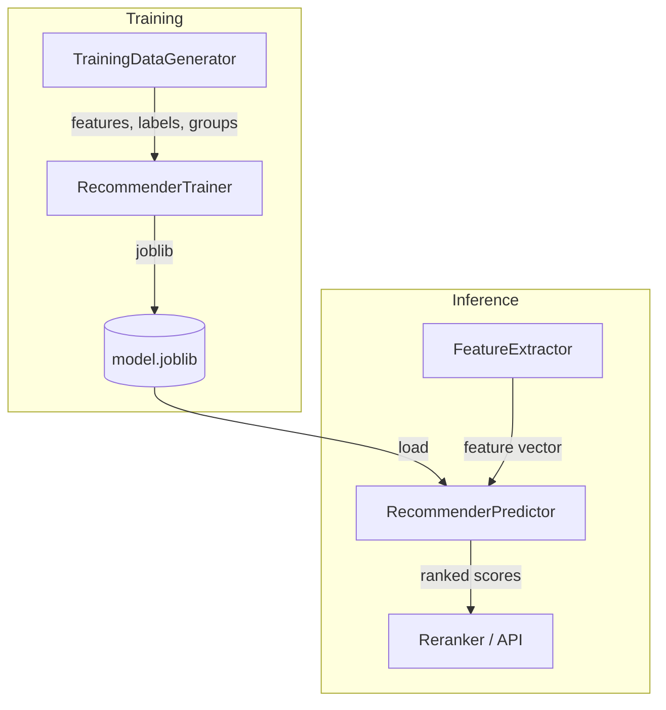

# Recommender Package

The `recommender` package is a LightGBM learning-to-rank model that re-scores retrieval candidates using features beyond embedding similarity. It covers the full ML lifecycle: feature engineering, synthetic training data generation, model training, serialization, and inference.

## What It Does

Four modules:

- **`features`** — `FeatureExtractor` computes six numerical features from a query-document pair: embedding similarity, temporal decay, protocol match, asset type match, popularity score, and recency boost
- **`data`** — `TrainingDataGenerator` produces synthetic query-document pairs with graded relevance labels (0–4) for LambdaRank training
- **`trainer`** — `RecommenderTrainer` trains an `LGBMRanker` with LambdaRank objective optimized for NDCG, and saves the model via joblib
- **`predictor`** — `RecommenderPredictor` loads a trained model and scores candidate documents at inference time

## Why It's Designed This Way

### Why a learned ranker instead of just cosine similarity

Vector similarity is a strong baseline for semantic relevance, but it has blind spots:

- **Temporal signals**: A 2024 advisory about a Modbus vulnerability is more useful than a 2019 one with similar wording. Cosine similarity has no concept of time
- **Metadata overlap**: An analyst researching PLC threats benefits from seeing documents tagged with PLC assets, even if the embedding similarity is slightly lower. This requires structured metadata awareness
- **Popularity**: Documents that other analysts frequently access are more likely to be useful. This is a collaborative signal, not a semantic one

A learned ranker combines all these signals into a single relevance score, letting the model discover which features matter most and how they interact.

### LambdaRank objective

The model uses LightGBM's `lambdarank` objective optimized for NDCG (Normalized Discounted Cumulative Gain). This is the standard approach for learning-to-rank because:

- **Listwise optimization**: LambdaRank optimizes the ranking of an entire result list, not individual document scores. It cares about getting the top results right more than perfectly scoring low-relevance documents
- **Graded relevance**: Labels range from 0 (irrelevant) to 4 (highly relevant), allowing the model to distinguish between "somewhat related" and "exactly what you need" — binary relevant/not-relevant would lose this signal
- **LightGBM speed**: LightGBM's histogram-based splits and leaf-wise growth make training fast even on the full feature matrix. Training on 200 queries x 20 documents takes under a second

### Six features, no feature store

The feature vector is intentionally compact:

| Feature | What it captures | Range |
|---------|-----------------|-------|
| `embedding_similarity` | Semantic relevance (cosine similarity) | [-1, 1] |
| `temporal_decay` | Document freshness (exponential, 180-day half-life) | (0, 1] |
| `protocol_match` | ICS protocol overlap (Jaccard similarity) | [0, 1] |
| `asset_type_match` | Asset type overlap (Jaccard similarity) | [0, 1] |
| `popularity_score` | Access frequency (log-scaled) | [0, 1] |
| `recency_boost` | Bonus for documents published in the last 30 days | [0, 1] |

All features are computed on the fly from data already available in the retrieval pipeline — no separate feature store or precomputation step. This keeps the inference path simple and avoids a cache invalidation problem.

### Synthetic training data

Real user interaction data doesn't exist for a demo system. The `TrainingDataGenerator` creates realistic training data by simulating three tiers of query-document relevance:

- **High relevance (label 3–4)**: Document embedding close to query, overlapping metadata, recent, popular
- **Medium relevance (label 1–2)**: Moderate embedding similarity, partial metadata overlap, older, moderate interactions
- **Low relevance (label 0)**: Random embedding, minimal overlap, old, few interactions

The generator uses a fixed seed (`42`) so training is deterministic. The synthetic data is designed to teach the model the correlation between feature values and relevance — the same patterns that would emerge from real user behavior.

### Pandas DataFrames for feature names

The trainer and predictor wrap feature arrays in `pd.DataFrame(features, columns=FEATURE_NAMES)` before passing them to LightGBM. This ensures consistent feature name tracking between training and inference, and avoids sklearn's `UserWarning` about missing feature names.

### Joblib for model serialization

The trained model is serialized with `joblib.dump()` rather than LightGBM's native `save_model()`. Joblib preserves the full `LGBMRanker` object including hyperparameters and the sklearn API, so `predict()` works identically after loading. The model file is small (tens of KB) and loads in milliseconds.

## Module Reference

### FeatureExtractor

| Method | Description |
|--------|------------|
| `embedding_similarity(query_emb, doc_emb)` | Cosine similarity between two embedding vectors |
| `temporal_decay(published, half_life_days=180)` | Exponential decay: `exp(-0.693 * age / half_life)` |
| `metadata_match(query_values, doc_values)` | Jaccard similarity between two sets |
| `popularity_score(interaction_count, max_interactions=100)` | Log-scaled normalization to [0, 1] |
| `recency_boost(published, boost_days=30)` | Linear decay from 1 to 0 over `boost_days` |
| `extract_features(...)` | Compute all six features for a query-document pair |

### TrainingDataGenerator

| Method | Description |
|--------|------------|
| `generate(n_queries=100, docs_per_query=20, embedding_dim=8)` | Return `(features, labels, groups)` numpy arrays for LightGBM |

### RecommenderTrainer

| Method | Description |
|--------|------------|
| `train(features, labels, groups)` | Train the LGBMRanker on provided data |
| `train_from_synthetic(n_queries=200, docs_per_query=20, seed=42)` | Generate synthetic data and train in one call |
| `get_feature_importance()` | Return `{feature_name: importance}` dict from the trained model |
| `save(path)` | Serialize the model with joblib |
| `model` | Property returning the trained `LGBMRanker` or `None` |

Hyperparameters:

| Parameter | Default | Description |
|-----------|---------|-------------|
| `n_estimators` | 100 | Number of boosting rounds |
| `learning_rate` | 0.1 | Step size shrinkage |
| `num_leaves` | 31 | Maximum tree leaves |
| `max_depth` | -1 | No depth limit |

### RecommenderPredictor

| Method | Description |
|--------|------------|
| `from_path(model_path)` | Class method to load a model from disk |
| `predict_scores(features)` | Score a feature matrix, return predicted relevance array |
| `rank_documents(query_embedding, candidates, top_k=10)` | Extract features from candidate dicts, score, and rank |
