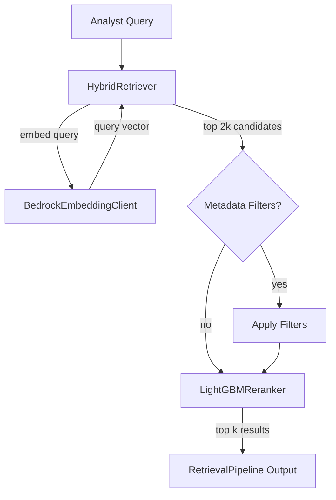

# Retrieval Package

The `retrieval` package is the bridge between the vector store and the LLM. It takes an analyst's natural-language query, finds the most relevant document chunks via vector similarity, optionally filters by metadata, and reranks the results using the LightGBM learning-to-rank model before handing them to the assistant as context.

## What It Does

Three modules:

- **`retriever`** — `HybridRetriever` combines vector similarity search with post-hoc metadata filtering over chunk metadata (severity, protocols, asset types, threat categories)
- **`reranker`** — A `Reranker` protocol plus a `LightGBMReranker` implementation that re-scores candidates using the trained recommender model
- **`pipeline`** — `RetrievalPipeline` orchestrates the full flow: retrieve → filter → rerank → return top-k with timing

## Why It's Designed This Way

### Over-retrieve then narrow

`HybridRetriever.retrieve()` fetches `top_k * 2` candidates from the vector store, then filters down. This is intentional: metadata filters are applied after the vector search, not before it. The trade-off:

- **Why not pre-filter in the vector store**: FAISS has no native metadata filtering. Pre-filtering would require maintaining separate indices per filter combination, which is impractical for the number of possible filter permutations (severity x protocols x asset types x categories)
- **Why 2x over-retrieval**: If filters remove half the candidates, we still have enough results to fill the requested `top_k`. The 2x multiplier is a pragmatic default — aggressive enough to survive typical filter rates, cheap enough that the extra FAISS search is negligible

### Post-hoc metadata filtering

Filters use set intersection logic: a chunk passes a filter if its metadata overlaps with the filter values. For example, a chunk with protocols `["modbus", "dnp3"]` passes a filter for `["modbus"]` because the intersection is non-empty. This matches how analysts think — "show me anything involving Modbus" — rather than requiring exact match.

Filters are independent and conjunctive: a chunk must pass all specified filters. If no filters are provided, all candidates pass through.

### Two-stage ranking

The pipeline runs two ranking stages:

1. **Vector similarity** (retriever) — exact cosine similarity search via FAISS `IndexFlatIP`. Good at semantic relevance but blind to temporal signals, metadata overlap, and popularity
2. **LightGBM reranking** (reranker) — a learned model that combines embedding similarity with additional features: temporal decay, protocol/asset overlap, and interaction counts

The reranker is optional. If no trained model is available (e.g. first-time setup), the pipeline gracefully falls back to vector-only ranking. This lets the system work out of the box and improve when a model is trained.

### Reranker as a protocol

Like `VectorStore`, the `Reranker` is a Python `Protocol`. The `LightGBMReranker` is the current implementation, but the protocol allows swapping in alternatives (cross-encoder models, reciprocal rank fusion, etc.) without changing the pipeline.

### Timing built into the pipeline

`RetrievalPipeline.run()` returns `(results, elapsed_ms)` as a tuple. The elapsed time covers the full flow — embedding, search, filtering, and reranking. This feeds directly into `ResponseMetadata.retrieval_time_ms` in the API response, giving analysts visibility into retrieval latency without separate instrumentation.

## Module Reference

### HybridRetriever

| Method | Description |
|--------|------------|
| `retrieve(query, top_k=20, filters=None)` | Embed the query, search the vector store for `2 * top_k` candidates, apply metadata filters, return top-k `(DocumentChunk, score)` pairs |
| `embed_query(query)` | Generate an embedding for the query text (used by the reranker) |
| `document_count` | Property returning the total number of chunks in the store |

**Supported filters** (via `QueryFilters`):

| Filter | Logic |
|--------|-------|
| `severity` | Chunk severity must be in the provided list |
| `protocols` | Chunk protocols must overlap with the provided set |
| `asset_types` | Chunk asset types must overlap with the provided set |
| `threat_categories` | Chunk threat category must be in the provided list |

### LightGBMReranker

| Method | Description |
|--------|------------|
| `rerank(query_embedding, candidates, top_k=5)` | Extract features from each candidate, score with the LightGBM model, return top-k sorted by predicted relevance |

Features extracted per candidate:

| Feature | Source |
|---------|--------|
| Embedding similarity | Cosine similarity between query and document embeddings |
| Temporal decay | Exponential decay based on document age |
| Protocol overlap | Jaccard-like score between query and document protocols |
| Asset type overlap | Jaccard-like score between query and document asset types |
| Interaction count | Popularity signal (defaults to 0 for new documents) |

### RetrievalPipeline

| Method | Description |
|--------|------------|
| `run(query, top_k=5, retrieval_k=20, filters=None)` | Full pipeline: retrieve → filter → rerank → return `(results, elapsed_ms)` |
| `total_documents` | Property returning the total chunk count from the retriever |
